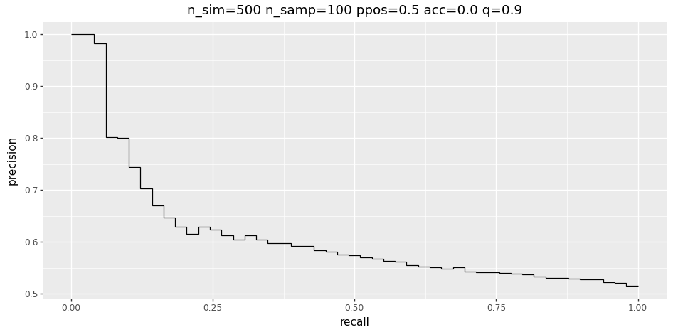

## Install

In project root
```bash
pip install .
```

## Example

```python
from nullmodel_precision_recall import plot_simulations

simulations = 500
samples = 100
quantile = 0.9

plot_simulations(simulations, samples, q=quantile)
```


